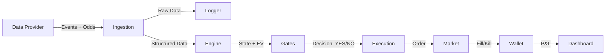

# BotBet System Specification & Retrospective

## 1. System Overview
**Project Name:** BotBet  
**Type:** Automated High-Frequency Trading System for Sports Betting (Live Football)  
**Goal:** To autonomously identify value in live betting markets by correlating real-time match events (xG, pressure) with bookmaker odds, executing trades when positive Expected Value (EV) is detected.

This document serves as the architectural blueprint and retrospective analysis of the system, "reverse-engineered" from its implementation.

## 2. Architectural Design

The system follows a **Event-Driven, Loop-Based Architecture**. It is designed to be modular, separating data ingestion, state analysis, decision logic, and execution.

### 2.1 Core Components
1.  **Ingestion Layer (`main.py`):**
    *   Responsible for fetching real-time data (Match Events & Market Odds).
    *   Normalizes raw streams into structured objects.
    *   Calculates system health metrics (Latency).
2.  **State Engine (`engine.py`):**
    *   **Threat Pressure Score (TPS):** Aggregates granular events (shots, corners, cards) into a high-level state (LOW, MID, PRESS, CHAOS).
    *   **Match State:** Maintains the "truth" of the match (current minute, score, accumulated stats).
3.  **Decision Logic (The "Gates"):**
    *   A fail-fast series of checks. A bet is only placed if *all* gates open.
    *   **Gate 1: Latency.** Is data too old? (> 3s).
    *   **Gate 2: Market.** Is the market suspended?
    *   **Gate 3: Quality.** Is the game active enough? (TPS != LOW).
    *   **Gate 4: EV.** Does our internal probability model beat the bookie's price?
4.  **Execution Layer (`execution.py`):**
    *   Handles the interface with the betting provider/exchange.
    *   Simulates real-world friction: **Slippage** (price moving against us) and **Rejections**.
5.  **Accounting (`wallet.py`):**
    *   Paper Trading implementation to track performance without financial risk.
    *   Records P&L, ROI, and Win/Loss ratios.

### 2.2 Data Flow

## 3. Data Models (`schemas.py`)

Strict typing via `Pydantic` ensures data integrity throughout the pipeline.

*   **`Event`:** Atomic match occurrence (Shot, Goal, Card). Contains timestamp (`t_event`) and receipt time (`t_recv`) for latency tracking.
*   **`Odds`:** Market price snapshot. Contains Selection (e.g., "Over 2.5 Goals") and Price.
*   **`MatchState`:** The derived context of the match. Includes `tps_label` and `event_latency_p95`.

## 4. Key Algorithms

### 4.1 Threat Pressure Score (TPS)
A heuristic model to quantify match intensity.
*   **Inputs:** xG (Expected Goals), Danger Attacks, Cards, Team Activity.
*   **Logic:**
    *   `CHAOS`: Red Cards or High Danger Attacks from both teams.
    *   `PRESS`: High accumulated xG/Danger in last 10 mins.
    *   `LOW`: Low activity.
*   **Usage:** We filter out `LOW` intensity matches to avoid "dead" games.

### 4.2 Probability & EV Model
*   **Model:** Poisson Distribution.
*   **Rate Parameter:** Extrapolated from the last 10 minutes of xG (`xg_10m`).
*   **Formula:** `P(Goal) = 1 - exp(-rate * time_remaining)`
*   **EV Calculation:** `EV = (Probability * Odds) - 1`.
*   **Threshold:** Only bet if EV > 5% (`0.05`).

## 5. Operational Safety & Configuration

### 5.1 The "Gates" Mechanism
To prevent bad trades, the system enforces hard constraints:
*   `L_MAX` (3.0s): Max allowable latency. If data is stale, DO NOT bet.
*   `MARKET_SUSPENDED`: Never trade on a suspended line.
*   `MATCH_LIMIT`: Max bets per match (default 1) to prevent over-exposure on a single event.

### 5.2 Logging & Replayability
*   **`events_log.jsonl`**: Raw dump of all incoming events. Allows for full replay and backtesting.
*   **`decisions.jsonl`**: Structured log of every loop cycle. Why did we bet? Why did we skip? (Audit trail).

## 6. Future Roadmap (Post-MVP)

1.  **AsyncIO:** Move from blocking loop to `asyncio` for handling multiple matches concurrently.
2.  **Live Provider:** Replace `mock_provider` with a real API (e.g., Sportmonks, Betfair).
3.  **ML Model:** Replace heuristic Poisson model with a trained Machine Learning classifier (XGBoost/LightGBM) for probability estimation.
4.  **State Persistence:** Use a database (SQLite/Postgres) instead of in-memory lists for robustness against crashes.

## 7. Configuration Reference (`config.yaml`)

| Parameter | Default | Description |
| :--- | :--- | :--- |
| `L_MAX` | 3.0 | Maximum allowed P95 latency (seconds) |
| `EV_MIN` | 0.05 | Minimum Expected Value required to bet |
| `XG_10M_MIN` | 0.2 | Minimum xG in last 10m to consider "Active" |
| `WALLET_START` | 1000.0 | Initial paper trading balance |
| `STAKE` | 10.0 | Fixed stake amount per bet |